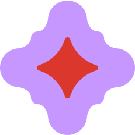

  

    

  

   

  

 

<!-- Platforms -->

  

  

  

  

  

 

<!-- Social Media -->

 
  

 
  

  

 

<!-- Programming Languages -->

  

  

  

  

  

  

 

<!-- Currently Learning -->

  

  

  

  

  

  

  

  

  

  

<!-- EFECTO DE ASOMARSE AL FINAL -->

  <!-- Asegúrate de cambiar 'peeking.png' por el nombre que le diste a la imagen recortada -->
  

